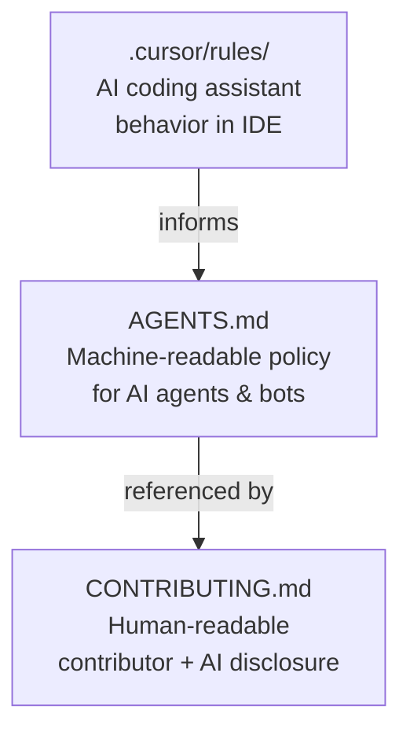

# CosmoSoft AI Policies Plan

## Reference Sources Used

- **KubeFlow SDK `AGENTS.md`** — agent behavior policy, code quality standards, test structure, security checklist
- **KubeFlow `CONTRIBUTING.md`** — Conventional Commits, pre-commit, KEP process
- **Red Hat "When bots commit"** — attribution via commit trailers, license compliance, security review of AI output
- **Red Hat Open Source Participation Guidelines** — upstream-first, CLA considerations

---

## Three-Layer Structure



---

## Layer 1 — `.cursor/rules/` (Cursor AI Rules)

New files inside `/Users/hslyusar/Desktop/CosmoSoft/.cursor/rules/`:

### `general.mdc` — Global rules for all files
- C++20 style: `snake_case` for variables/functions, `PascalCase` for classes, `UPPER_SNAKE_CASE` for constants
- No raw owning pointers — use `std::unique_ptr` / `std::shared_ptr`
- All public functions must have Doxygen `/** @brief */` comments
- No `TODO`/`FIXME` committed — raise a GitHub Issue instead
- No secrets, credentials, or device paths hard-coded
- Match import/include patterns from neighboring files before adding new ones

### `cmake.mdc` — CMake rules (glob: `CMakeLists.txt`, `*.cmake`)
- Never use `file(GLOB ...)` for source lists — list files explicitly
- New libraries must follow the existing `OBJECT` / `STATIC` / `INTERFACE` pattern in `src/CMakeLists.txt`
- New dependencies require a comment explaining why

### `telemetry.mdc` — Telemetry pipeline rules (glob: `src/services/telemetry/**`)
- `Framer` and `Parser` are the only places that touch raw bytes — no byte manipulation elsewhere
- `ParserWorker` must never block the Qt main thread
- All new `FlightSample` fields must be added to `FlightSample.h` first, then wired through `FlightDataModel`

### `gui.mdc` — Qt GUI rules (glob: `src/gui/**`, `include/gui/**`)
- No business logic in page/widget classes — delegate to services
- All cross-thread signals must use `Qt::QueuedConnection`
- `QSettings` keys must be declared as `constexpr` string constants, never inline literals

---

## Layer 2 — `AGENTS.md` (KubeFlow-inspired, C++/Qt6 adapted)

New file: `/Users/hslyusar/Desktop/CosmoSoft/AGENTS.md`

### Sections to include:

**Who this is for** — AI agents, contributors using AI assistants, maintainers

**Agent Behavior Policy**
- Make atomic, minimal, reversible changes
- Run `cmake --build build` and verify zero warnings before proposing commits
- NEVER modify `CMakeLists.txt`, CI, or `assets/resources.qrc` unless explicitly requested
- No non-deterministic code (no unseeded random, no `time()`-based logic in tests)

**Agents must NOT**
- Bypass `clang-format` or `cppcheck`
- Introduce new third-party libraries without updating CMake and documenting the reason
- Generate or commit large auto-generated files (e.g. no committing `build/` artifacts)
- Add Windows-only or POSIX-only code without a matching `#if defined(...)` guard and a note in `README.md`

**Repository Map** — mirrors the structure in `README.md`

**Build & Verify Commands**
```bash
cmake -S . -B build && cmake --build build    # build
clang-format --dry-run --Werror src/**/*.cpp  # format check
cppcheck --enable=all src/                    # static analysis
```

**Core Development Principles** (adapted from KubeFlow)
1. Stable public interfaces — do not change `IComms`, `FlightSample`, or `FlightDataModel` public APIs without a discussion Issue
2. Code quality — type safety, RAII, no raw `new`/`delete`
3. Testing — every new service function needs a Catch2 unit test
4. Security checklist — no `system()`, no hard-coded paths, proper resource cleanup
5. Documentation — Doxygen for all public headers

**AI-Generated Code Section** (aligned with Red Hat policy)
- Disclose AI assistance via a commit trailer: `Assisted-by: <tool-name>`
- Trivial AI use (autocomplete, docstrings) does not require disclosure
- AI-generated code must pass the same review bar as human code — no exceptions
- Do not commit AI-generated code that you cannot explain and defend in a review

---

## Layer 3 — `CONTRIBUTING.md` (Human-facing)

New file: `/Users/hslyusar/Desktop/CosmoSoft/CONTRIBUTING.md`

### Sections:

**Getting Started** — build prerequisites (CMake 3.21+, C++20, Qt 6.2+), build commands from `README.md`

**Development Workflow**
- Fork → branch (`feat/`, `fix/`, `chore/` prefixes) → PR
- PR titles follow [Conventional Commits](https://www.conventionalcommits.org/en/v1.0.0/): `feat(telemetry): implement Framer sync pattern`
- One logical change per PR; keep diffs reviewable

**Coding Standards** — link to `.cursor/rules/` and `AGENTS.md`

**Testing** — run Catch2 suite before opening a PR; CI will block merges if tests fail

**AI-Assisted Contributions** (Red Hat-aligned)
- AI tools are welcome — they are consistent with Red Hat's "upstream first" approach to AI-assisted development
- Disclose with a commit trailer: `Assisted-by: Cursor` / `Assisted-by: GitHub Copilot`
- You are responsible for all code you submit — AI-generated code must be understood and reviewed by you before submitting
- License compliance: do not submit AI output that replicates copyrighted patterns; run a license scan if in doubt
- Security: AI suggestions must pass the same security checklist as hand-written code (no hard-coded secrets, no deprecated crypto, no `eval`/`system()`)

**Significant Changes — Enhancement Proposals**
- For changes touching public APIs (`IComms`, `FlightSample`, `FlightDataModel`) or the binary telemetry protocol, open a GitHub Issue first and get consensus before coding
- Mirrors KubeFlow's KEP process, but lightweight: a clear Issue description is sufficient for v1

**Code of Conduct** — reference to `CODE_OF_CONDUCT.md` (to be added separately)

**License** — MIT; contributions are accepted under the same license

---

## Files to Create

- `.cursor/rules/general.mdc`
- `.cursor/rules/cmake.mdc`
- `.cursor/rules/telemetry.mdc`
- `.cursor/rules/gui.mdc`
- `AGENTS.md`
- `CONTRIBUTING.md`

---

## Alignment Summary

| Policy Area | KubeFlow Reference | Red Hat Reference | Applied to CosmoSoft |
|---|---|---|---|
| Commit format | Conventional Commits | — | Same |
| Agent behavior | AGENTS.md behavior rules | — | Adapted for C++/CMake |
| AI disclosure | — | `Assisted-by:` commit trailer | In AGENTS.md + CONTRIBUTING.md |
| License compliance | — | License scanning, attribution | In CONTRIBUTING.md AI section |
| Security of AI code | Security checklist | "security by design" | In AGENTS.md security checklist |
| Upstream-first | — | Red Hat participation guidelines | Referenced in CONTRIBUTING.md |
