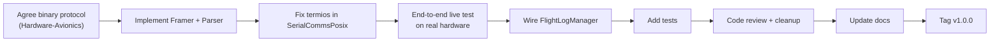

# CosmoSoft v1.0 Release Plan

## Current State (What Actually Works Today)

- CSV replay + charts + monitoring tiles — **fully functional**
- Serial byte plumbing (byte count, data rate display) — **functional but no decoded data**
- Qt shell (pages, settings, toolbar, file open, replay controls) — **functional**

## What Is Broken or Stubbed

- `Framer` / `Parser` — **complete no-ops**; live serial and `.telem` never produce `FlightSample`
- `SerialCommsPosix::open()` — baud rate **never applied** (no `termios`)
- `FlightLogManager` / `RingBuffer` — implemented but **not wired into `MainWindow`**
- Windows serial — **empty stubs**; `CommsFactory` would fail to compile on Windows
- **No tests** anywhere in the repo

## Release Scope Decision

**v1.0 = macOS + Linux only.** Windows serial is explicitly deferred to v1.1. This avoids shipping a `#error` path and matches the team's current dev environment.

---

## Work Items (Ordered by Criticality)

### 1. Unblock the Data Format (Prerequisite — External)

The serialised binary protocol must be agreed with the Hardware-Avionics team before `Framer`/`Parser` can be written. This is the **single most important blocker** to getting live telemetry working.

- Outcome needed: a document or spec (even informal) describing the packet structure: sync bytes, length, field layout, checksum
- Once agreed, captured in `docs/protocol.md`

---

### 2. Implement `Framer` and `Parser`

Files: [`src/services/telemetry/Framer.cpp`](src/services/telemetry/Framer.cpp), [`src/services/telemetry/Parser.cpp`](src/services/telemetry/Parser.cpp)

- `Framer::ingest` — buffer incoming bytes; `try_next_frame` — scan for sync pattern, extract complete frame
- `Parser::decode` — map frame bytes to `FlightSample` fields per the agreed protocol
- This makes **both** live serial **and** `.telem` replay actually work end-to-end

---

### 3. Fix `SerialCommsPosix` — Apply `termios`

File: [`src/gateway/comms/Posix/SerialCommsPosix.cpp`](src/gateway/comms/Posix/SerialCommsPosix.cpp)

Currently `open()` calls `::open(2)` and returns — baud, 8N1, raw mode are never set. The fix:

- After `open(2)`, call `tcgetattr` → configure `cfsetispeed` / `cfsetospeed`, `8N1`, `VMIN=0 VTIME=1` for non-blocking reads
- Without this, the OS uses whatever default TTY settings are in effect, which will almost certainly corrupt incoming bytes

---

### 4. Wire `FlightLogManager` Into the Main Window

File: [`src/services/persistence/FlightLogManager.cpp`](src/services/persistence/FlightLogManager.cpp), [`src/gui/MainWindow.cpp`](src/gui/MainWindow.cpp)

`FlightLogManager` is implemented but never used — it cannot record live sessions. Changes:

- Instantiate `FlightLogManager` in `MainWindow`
- On `startSerial`: call `beginSession()` / set a log path
- Connect `FlightDataModel::sampleUpdated` → `FlightLogManager::addSample`
- On `stopSerial` or disconnect: call `exportSessionToTextFile` (or equivalent)
- Add a **"Save log…"** menu/button so the user can choose where to save

---

### 5. Add a Minimal Test Suite

No tests exist. A small suite covering the most critical path protects the only guaranteed-working import path.

Suggested framework: **Catch2** (header-only, CMake-native, no Qt dependency needed for pure-logic tests).

Tests to write first:

- `SampleFileLoader` CSV — valid Theseus CSV → expected `FlightSample` values
- `SampleFileLoader` CSV — missing required column → returns error string
- `Framer` + `Parser` — once implemented: known byte sequence → expected `FlightSample`
- `RingBuffer` — basic put/get boundary checks (already implemented, just untested)

Files: new `tests/CMakeLists.txt`, `tests/test_file_loader.cpp`, `tests/test_telemetry_pipeline.cpp`

---

### 6. Code Review and Cleanup

Per [Project Management.md](Project%20Management.md) — already listed as Critical.

- Remove `Q_UNUSED(hostWindow)` in `MonitoringPage.cpp` — dead parameter, remove from constructor signature
- Replace the hard-coded `"DO NOT FORGET TO CONNECT WIFI AND CABLE TO ROCKET."` UI string with a proper status enum / localised string
- Review `#include` paths in `src/gateway/comms/Windows/` (wrong casing) — won't block v1 but leaves the tree inconsistent
- Confirm `RingBuffer` ownership semantics (destructor does not free memory — document or fix)
- Scope Windows in `CMakeLists.txt` with a clear `# Windows serial: not implemented for v1.0` comment rather than a silent `#error`

---

### 7. Documentation Update

File: [`README.md`](README.md)

- Add a **"v1.0 scope"** section: what works, what is deferred
- Add architecture diagram (serial → `ParserWorker` → `FlightDataModel` → UI)
- Document the Theseus CSV format expected by the importer (column names, units)
- Add a `CONTRIBUTING.md` (already called out in [plan.md](plan.md))
- Add `docs/protocol.md` once the binary format is decided

---

### 8. Tag and Release

- Ensure `build/` is gitignored and not committed (already in `.gitignore`, but the current git status shows modified files inside `build/` — those should not be staged)
- Set the version somewhere (e.g. `CMakeLists.txt` `project(cosmo-soft VERSION 1.0.0)`)
- Create a GitHub release tag `v1.0.0` with release notes covering scope, known limitations, and build instructions

---

## Critical Path

The **external dependency (step A)** is the only thing the team cannot resolve in code. Everything else is sequential engineering work with no external blockers.

---

## What v1.0 Will Deliver

- Live serial telemetry decoded and shown in the UI (macOS + Linux)
- CSV replay with charts fully working
- `.telem` file replay working
- Live session saved to file on disconnect
- Documented protocol + architecture
- Minimal test suite protecting the critical path
