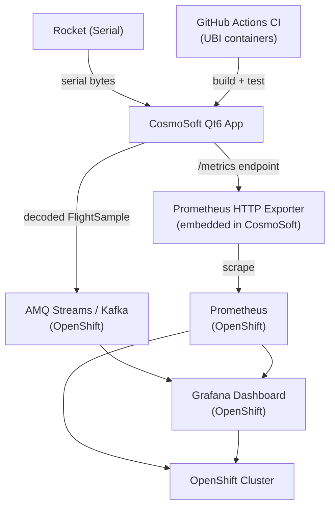

# Red Hat Instruments Integration Plan for CosmoSoft

## Context

CosmoSoft is currently a **Qt6 C++ desktop ground station** with a working CSV replay path and a stubbed binary telemetry pipeline. It has no CI/CD, no containerisation, and no backend services. The [plan.md](plan.md) targets Red Hat sponsorship by positioning the project as an observability platform for edge/constrained environments.

Red Hat "instruments" = their open-source tools: **Prometheus, Grafana, OpenShift, AMQ Streams (Kafka), Tekton, Podman, UBI**.

---

## Architecture After Integration

---

## Phase 1 — CI/CD with Red Hat UBI (Weeks 1–2)

**Goal:** Automated build pipeline running inside Red Hat Universal Base Image containers.

- Add `.github/workflows/build.yml` — builds CosmoSoft inside a `registry.access.redhat.com/ubi9/ubi` container with Qt6 and CMake
- Add `Containerfile` (Podman-native naming) for the build environment
- Add `scripts/build-podman.sh` for local Podman-based builds

This is the lowest-effort, highest-credibility integration — every CI build touches Red Hat infrastructure.

---

## Phase 2 — Prometheus Metrics Exporter (Weeks 2–3)

**Goal:** CosmoSoft exposes a `/metrics` HTTP endpoint that Prometheus can scrape.

- Add a lightweight HTTP server component to CosmoSoft (using Qt's `QTcpServer` — no new dependencies)
- Expose metrics as Prometheus text format:
  - `cosmosoft_altitude_meters`
  - `cosmosoft_temperature_celsius`
  - `cosmosoft_pressure_hpa`
  - `cosmosoft_rssi_dbm`
  - `cosmosoft_battery_mv`
  - `cosmosoft_bytes_received_total`
- Hook into `FlightDataModel`'s `sampleUpdated` signal to update metric values
- Key files to create/modify:
  - `src/services/metrics/PrometheusExporter.cpp` (new)
  - `include/services/metrics/PrometheusExporter.h` (new)
  - `src/services/metrics/CMakeLists.txt` (new)
  - `src/gui/MainWindow.cpp` — instantiate exporter, connect to `FlightDataModel`

---

## Phase 3 — MQTT / Kafka Telemetry Forwarding (Week 3–4)

**Goal:** Forward decoded `FlightSample` events to a Kafka topic via Red Hat AMQ Streams, enabling a distributed consumer model.

- Add a `TelemetryPublisher` service that serialises `FlightSample` to JSON and publishes to a Kafka/MQTT broker
- Use [librdkafka](https://github.com/confluentinc/librdkafka) or a lightweight MQTT client (e.g. `mosquitto`) — both are available as system packages on RHEL/UBI
- Key files:
  - `src/services/telemetry/TelemetryPublisher.cpp` (new)
  - `include/services/telemetry/TelemetryPublisher.h` (new)
  - `deploy/kafka/` — Kafka topic config YAMLs for AMQ Streams on OpenShift
- This satisfies the Messaging row in [plan.md](plan.md)'s alignment table

---

## Phase 4 — OpenShift / Kubernetes Deployment (Weeks 4–5)

**Goal:** Deploy the observability stack (Prometheus + Grafana + Kafka) on OpenShift, demonstratable to Red Hat engineers.

- Add `deploy/` directory:
  - `deploy/prometheus/` — `ConfigMap` with scrape config targeting CosmoSoft's `/metrics`
  - `deploy/grafana/` — pre-built dashboard JSON for all telemetry metrics
  - `deploy/kafka/` — AMQ Streams `Kafka` and `KafkaTopic` CRDs
  - `deploy/helm/cosmosoft-observability/` — Helm chart bundling all the above
- The ground station desktop app itself stays local (physical hardware constraint); the cloud side runs on OpenShift
- A `docker-compose.yml` / `podman-compose.yml` enables local demo without a cluster

---

## Phase 5 — Complete the Binary Telemetry Pipeline (Prerequisite for Phases 2–3)

**Goal:** Replace the `Framer`/`Parser` stubs so live data actually flows — without this, Prometheus metrics and Kafka forwarding have nothing real to export.

- Unblock the serialised data format decision with the Hardware-Avionics team (already flagged as critical in [Project Management.md](Project%20Management.md))
- Implement `Framer::ingest` / `Framer::try_next_frame` for the agreed format
- Implement `Parser::decode` → `FlightSample`
- Fix `SerialCommsPosix` to apply baud rate and 8N1 via `termios`
- Key files: `src/services/telemetry/Framer.cpp`, `src/services/telemetry/Parser.cpp`, `src/gateway/comms/Posix/SerialCommsPosix.cpp`

---

## Priority Order (Given May 2026 Deadline)

- Phase 1 (CI/CD) — immediate, unblocks everything, easy Red Hat story
- Phase 5 (real telemetry) — critical blocker for meaningful demo
- Phase 2 (Prometheus) — core of the observability pitch
- Phase 4 (OpenShift deploy) — highest sponsorship impact
- Phase 3 (Kafka) — medium priority, adds distributed systems credibility

---

## Files Added / Modified Summary

- New: `.github/workflows/build.yml`, `Containerfile`
- New: `src/services/metrics/PrometheusExporter.{h,cpp}`
- New: `src/services/telemetry/TelemetryPublisher.{h,cpp}`
- New: `deploy/helm/`, `deploy/prometheus/`, `deploy/grafana/`, `deploy/kafka/`
- Modified: `src/gui/MainWindow.cpp` — wire up exporter and publisher
- Modified: `src/services/telemetry/Framer.cpp`, `Parser.cpp` — implement stubs
- Modified: `src/gateway/comms/Posix/SerialCommsPosix.cpp` — apply termios baud/8N1
